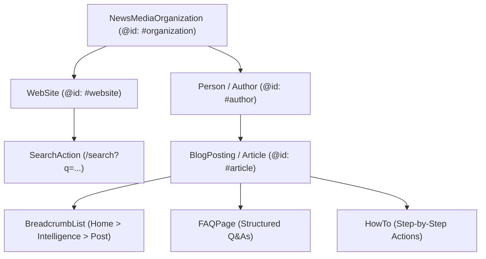

# 🌐 Knowledge Graph & Interlocking JSON-LD Architecture

**Purpose:** Definitive specification of semantic entity grounding and structured JSON-LD schemas powering Crypto Airdrop AI.

**Summary:** Details the interlocking node hierarchy that connects our organization, website, authors, articles, and FAQs into a single machine-readable knowledge graph recognized by Google, Bing, and LLM search engines.

---

## 1. Interlocking Schema Node Graph

---

## 2. Core Schema Node Definitions

### 1. Primary Organization Node (`#organization`)
- **Type**: `NewsMediaOrganization`
- **URI**: `https://cryptoairdropai.com/#organization`
- **Entity Grounding (`knowsAbout`)**:
  * Cryptocurrency Airdrops
  * Decentralized Finance (DeFi)
  * Ethereum Layer 2 Rollups
  * Solana Blockchain Ecosystem
  * Smart Contract Auditing
  * Sybil Resistance Heuristics
  * Tokenomics & TGE Distribution Models
- **Trust & E-E-A-T Anchors**:
  * `publishingPrinciples`: `https://cryptoairdropai.com/editorial-policy/`
  * `correctionsPolicy`: `https://cryptoairdropai.com/editorial-policy/`
  * `actionableFeedbackPolicy`: `https://cryptoairdropai.com/contact/`

### 2. Primary WebSite Node (`#website`)
- **Type**: `WebSite`
- **URI**: `https://cryptoairdropai.com/#website`
- **Search Action**: `https://cryptoairdropai.com/search?q={search_term_string}`

### 3. Author Node (`#author`)
- **Type**: `Person`
- **URI**: `https://cryptoairdropai.com/authors/<slug>/#author`
- **E-E-A-T Badges**: Role, job title, social verification (`sameAs` links to X/Twitter, LinkedIn, GitHub).

### 4. Article Node (`#article`)
- **Type**: `BlogPosting`
- **URI**: `https://cryptoairdropai.com/blog/<slug>/#article`
- **Canonical Parity**: 100% trailing slash match on `url` and `mainEntityOfPage`.
- **Interlocking Attributes**:
  * `isPartOf`: `{"@id": "https://cryptoairdropai.com/#website"}`
  * `publisher`: `{"@id": "https://cryptoairdropai.com/#organization"}`
  * `author`: `{"@id": "https://cryptoairdropai.com/authors/<slug>/#author"}`

---

## 3. Related Notes
- [[000-Index]]
- [[MOC-SEO-AEO-GEO]]
- [[AEO-and-SGE-Optimization-Standard]]
- [[GEO-Generative-Engine-Optimization-Rules]]
- [[2026-08-20-Omnichannel-AEO-GEO-Knowledge-Graph-Pipeline]]
