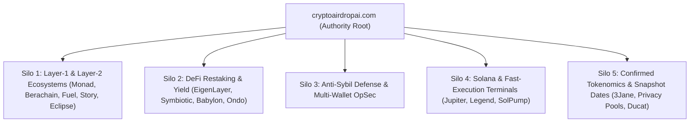

# 🏛️ Topical Authority & Content Silos Blueprint

**Purpose:** Defines the 5 core thematic silos and internal linking architecture for establishing absolute topical authority in the crypto airdrop search vertical.

---

## 1. The 5 Core Content Silos

---

## 2. In-Body Contextual Internal Linking Rules

1. **Every New Blog Post MUST link to**:
   - At least 1 core foundation guide (`/guides/setting-up-a-farming-wallet/` or `/guides/avoiding-sybil-detection/`).
   - The evaluation framework (`/methodology/`).
   - 1 or 2 sibling playbooks within the same thematic silo.
2. **Anchor Text Standard**: Use descriptive, entity-rich anchor text (e.g. *"read our [Multi-Wallet Sybil Defense Manual](https://cryptoairdropai.com/blog/how-to-farm-airdrops-safely-2026/)"*) rather than generic strings like *"click here"*.
3. **Zero Orphan Pages**: Every article must be accessible via `/blog/` and the dynamic homepage grid on `/`.

---

## 3. Related Notes
- [[000-Index]]
- [[MOC-SEO-AEO-GEO]]
- [[AEO-and-SGE-Optimization-Standard]]
- [[GEO-Generative-Engine-Optimization-Rules]]
