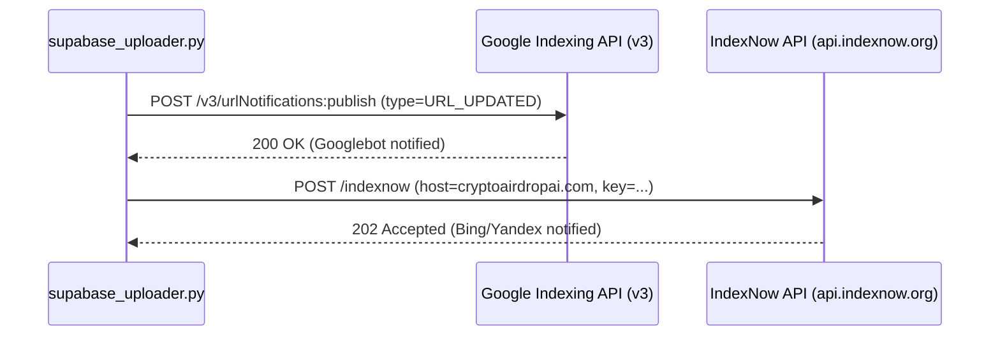

# ⚡ Supabase Database & Instant Search Indexing Pipeline

**Purpose:** Operational runbook and technical specifications for the Supabase PostgreSQL 17 headless CMS and search engine indexing connectors.

---

## 1. Database Schema & Direct Queries

- **Table**: `public.posts`
- **Primary Key**: `id UUID (gen_random_uuid())`
- **Unique Constraint**: `slug TEXT UNIQUE`
- **JSONB Columns**: `faqs` (list of Q&As), `key_takeaways` (list of bullets).

---

## 2. Search Engine Indexing Trigger Flow

Whenever a post is inserted or updated via `automation/modules/supabase_uploader.py`:

---

## 3. Credentials & Keys Configuration

- **Google Service Account**: `cosmic-mariner-503804-c4-981c45ff145b.json` (GSC Site Owner Verified).
- **IndexNow Key**: `b6a8d79c3f2e415a98d01c23e456789a`.
- **Supabase DB Pooler**: Port `6543`, host `aws-0-ap-northeast-1.pooler.supabase.com`.

---

## Related Notes
- [[000-Index]]
- [[MOC-Supabase-CMS-Automation]]
- [[2026-08-20-Supabase-Headless-CMS-Migration]]
